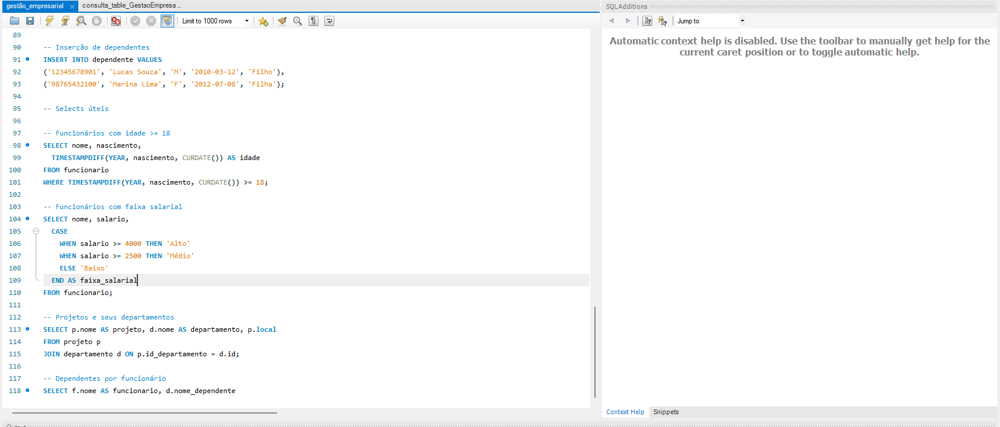
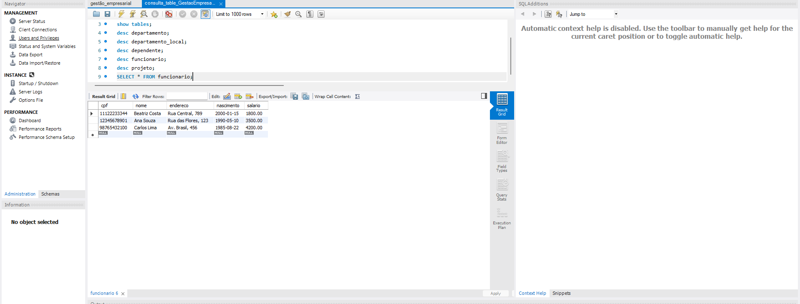
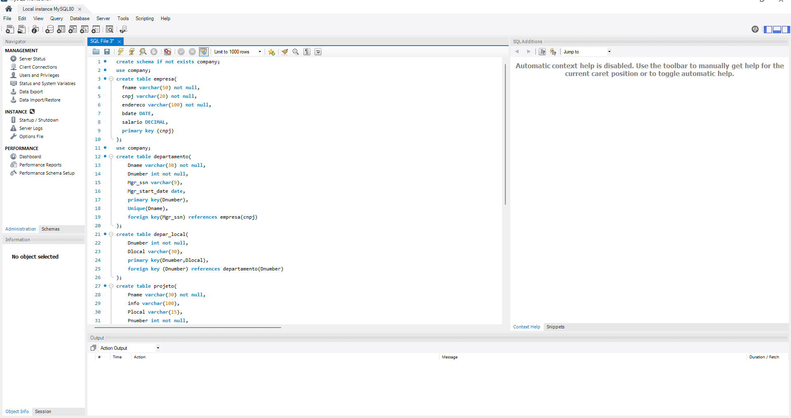

# 📊 Projeto de Gestão Empresarial  

Este projeto foi desenvolvido com foco em **gestão empresarial**, utilizando **SQL** para modelagem e manipulação de dados.  

## 📝 Descrição  
O sistema de banco de dados foi criado para representar cenários de gestão empresarial, incluindo:  
- Criação de **tabelas** com atributos relevantes.  
- Utilização de **SELECT** para consultas.  
- Inserção de dados com **INSERT**.  
- Aplicação de **condições** com `WHERE`.  
- Uso de **expressões condicionais** como `CASE`.  
- Definição de valores específicos e manipulação refinada de informações.  

## 🛠️ Tecnologias Utilizadas  
- **SQL** (MySQL)  
- Modelagem de dados  
- Comandos DDL e DML  

## 📂 Estrutura do Projeto  
- Scripts SQL de criação e manipulação de tabelas.  
- Consultas personalizadas para análise de dados.  

## 📸 Imagens do Projeto  
### Estrutura atual do projeto  
  

### Os dados inseridos na tabela  
  

### Início do desenvolvimento  
  

---

✍️ **Autor:** João Martins  
📅 **Ano:** 2025  
